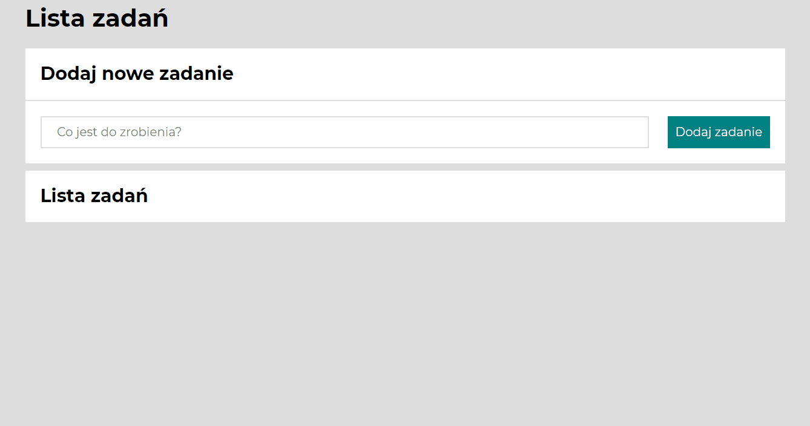

# To DO List

## Demo 
https://daniel-halasz.github.io/to-do-list/

## Description
Simple To-do list app. 

## Used Technologies 
1. HTML
2. CSS
3. FlexBox
4. CSS Grid
5. JavaScript with ES6+
6. BEM

## How to use
1. Enter a task to be performed and confirm by click button "Add task" or press enter.
2. Mark the done task by click the green button.
3. Click the red button with trash you will delete the task.

